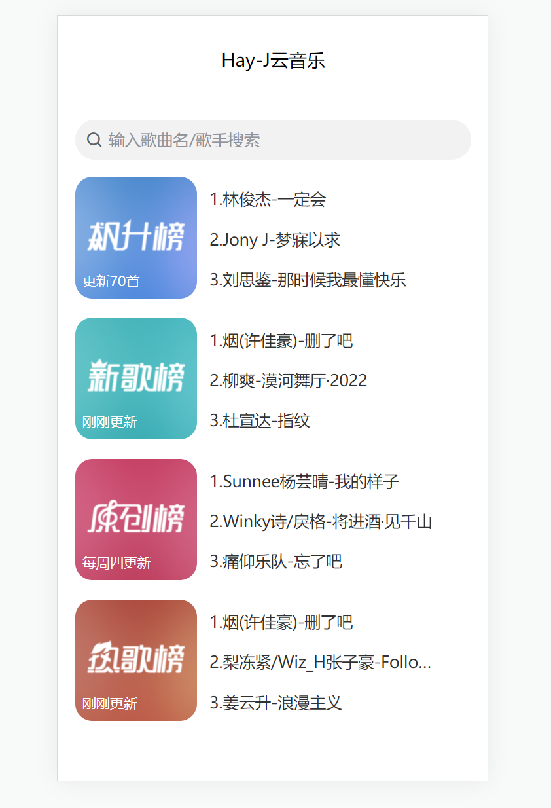
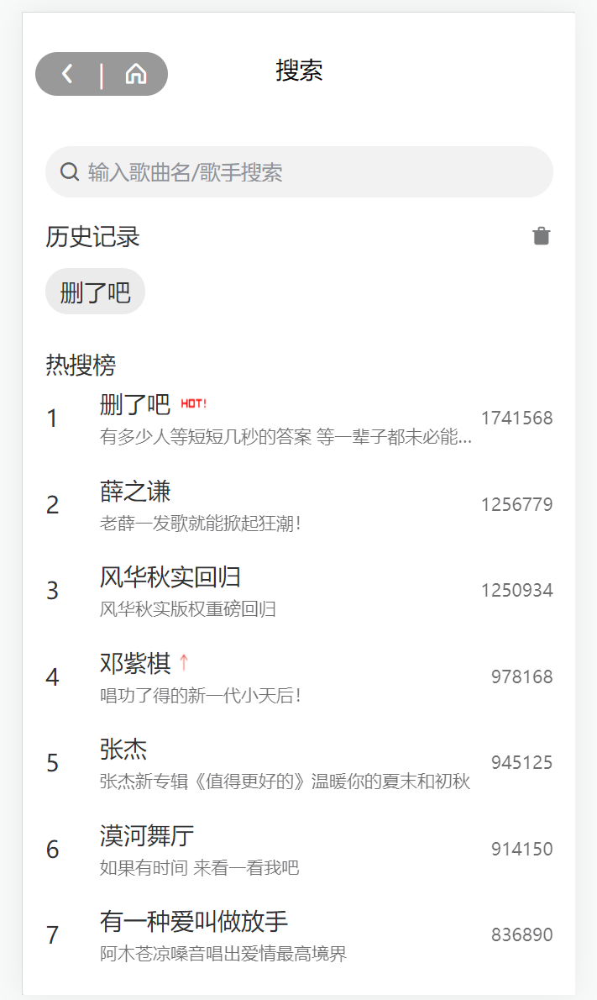
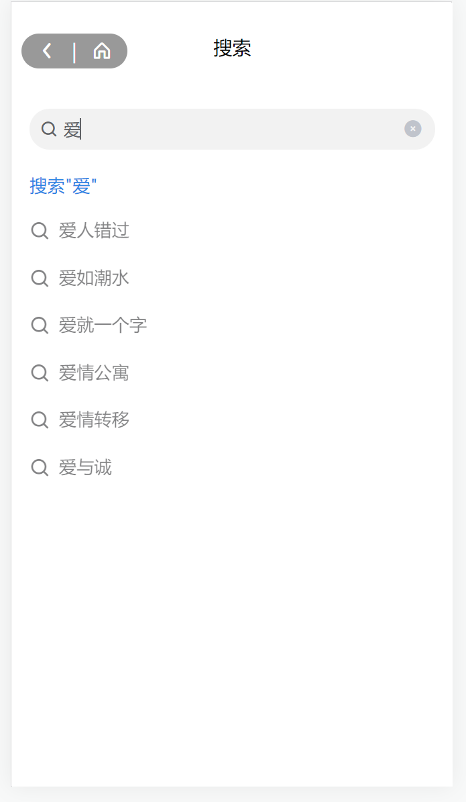
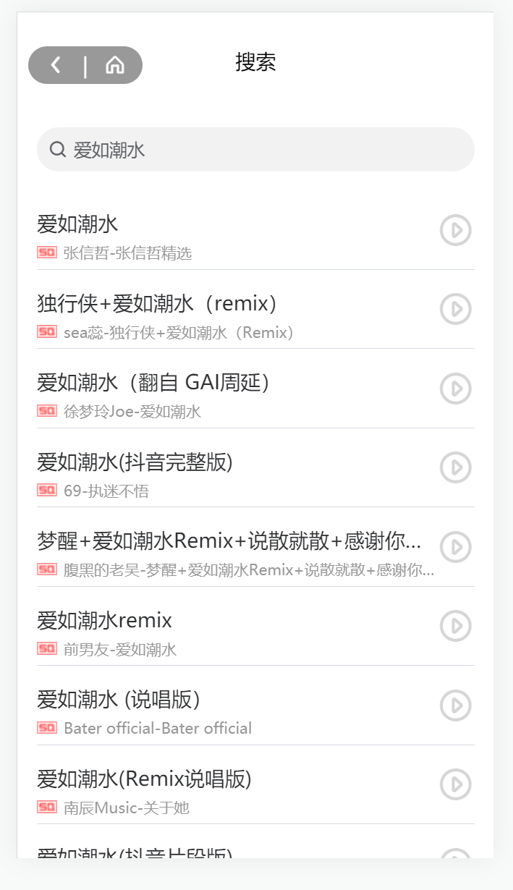
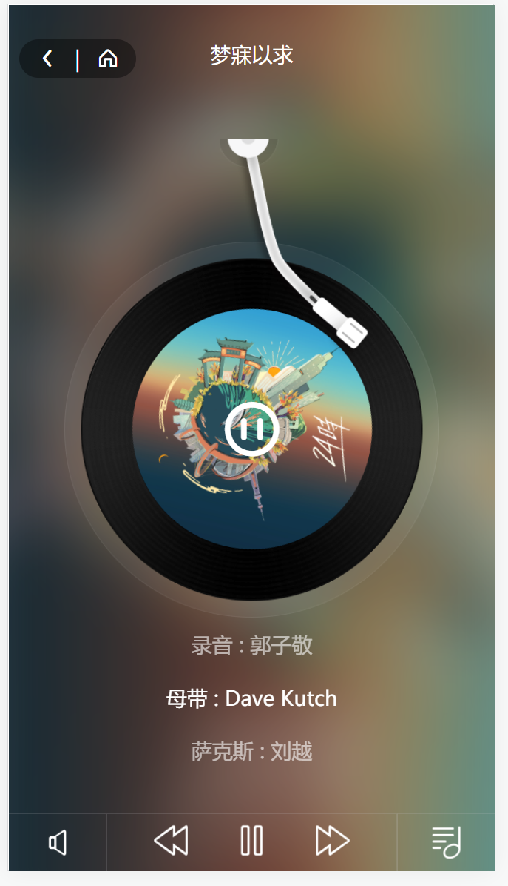
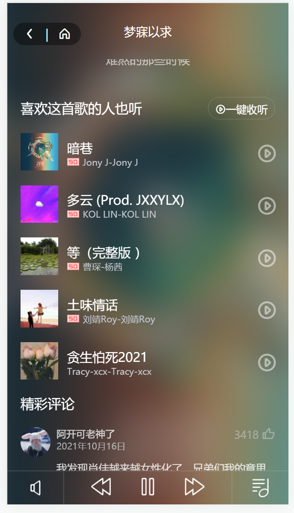
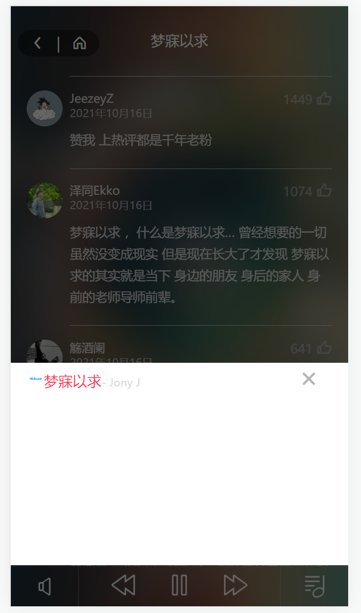

# My-NeteaseMusic
一个基于uniapp+uviewUI的在线听歌移动端H5和小程序应用。
>>>>>>> 132f762a0e49190494904f55cd3848351edaf1a9

## 前置准备

1.需要在本地开启网易云接口服务，接口服务在我另一个仓库[Api](https://github.com/Hay-J/NeteaseCloudMusicApi-Clone4.0.23.git)，服务开启后，就不用管了；
2.修改utils/request.js下的baseUrl为本地ip地址，例如："http://192.168.0.105:3000"，注：这里不用localhost是因为在小程序端实机调试时会获取不到数据，且实机调试时手机和电脑网络需要在同一局域网下

## 安装

```
$ git clone https://github.com/Hay-J/My-NeteaseMusic.git
$ npm install
```

## 运行

```
1.在Hbuilder打开工程文件，点击“运行到浏览器”或者是“小程序模拟器”
2.在浏览器访问http://localhost:8081/，注意网页需要打开调试模式切换为移动设备
```

## 项目预览

1. 首页

   首页这里有骨架屏加载动效（只在首页加了，其他页面加可以参考uview），为了体现效果延时了0.5s，可在pages/index下修改

   


2. 歌单详情页

   这个页面没什么特殊功能，不过布局要注意的地方蛮多的

   


3. 搜索页包含三个页面，根据不同情况显示不同的页面，默认进来显示热门搜索和历史搜索，如果有历史搜索则显示，没有则不显示，且历史搜索唯一且置顶；

   当在搜索框输入搜索词会根据搜索词请求搜索推荐的接口，这里做了防抖，减少对接口请求次数；

   点击搜索时，显示搜索结果页，这个页面实现了上拉（点击）加载更多和返回顶部功能，返回顶部也做了防抖。

   搜索页-默认

搜索页-搜索推荐

搜索页-结果页

4. 播放页面也是这个项目最主要的部分，实现了自动播放（这个在H5有时候不行，小程序肯定可以，有需要可以分开处理，让H5不自动播放，我这里没分开，我懒= =）、歌词滚动、自动续播、上下一首、一键收听、上拉（点击）加载更多、播放列表等功能。更多详情还是看代码吧，哈哈。

   






## 总结

起初我是想依借网易云Api（因为这是能找到的、现成的、完整的、且开源的后台接口）写一个关于vue的项目，没想用uniapp，然鹅在刷B站的时候看到某个up主（在写这个文档的时候没想起来）在写这个项目，看了一半决定自己也动手搞一个，也顺便入门一下uniapp和scss，项目也加入了一些自己的理解（功能），后期也许还会维护，也许哈。所以这个项目也存在很多很多的不成熟的地方，希望有幸被你看到的这位小伙伴能取精华取糟粕，貌似去了糟粕也没啥了，hhhhhhhhhhhh，完！

